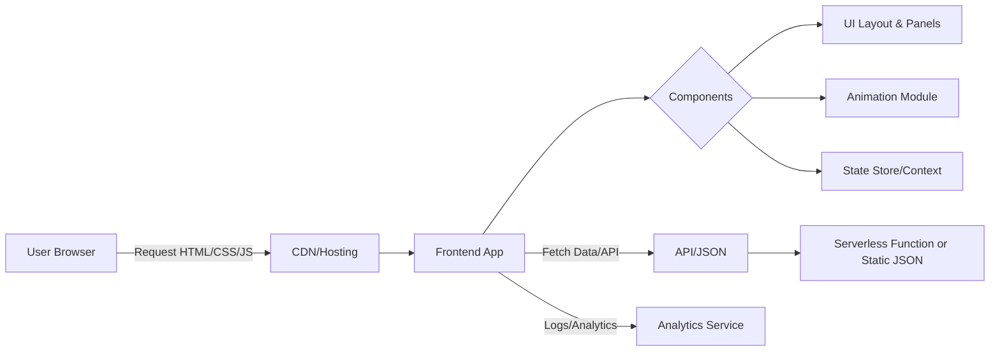

# Executive Summary

This report outlines a plan to redesign one section of a portfolio website in a *futuristic “system UI”* style (inspired by the provided manhwa/comics reference). We cover requirements, design considerations, and a proposed technology stack optimized for performance, accessibility, and ease of development. Key recommendations include using a modern frontend framework (e.g. React/Next.js or SvelteKit) with support for 3D or SVG animations (Three.js, WebGL or Framer Motion), utility-first styling (Tailwind CSS or CSS-in-JS), and a CI/CD pipeline for automated testing and deployment. We define functional features (interactive panels, hover effects, dynamic content loading) and non-functional targets (fast load, responsive design, WCAG compliance). An example architecture diagram (Mermaid) and project tree are provided, along with a phased roadmap with milestones and time estimates. In short, we aim to **“amp up the user’s portfolio section with neon-glow UI components and smooth animations, while keeping it maintainable and fast-loading”**.

## PRD.md (Product Requirements Document)

**Purpose:** Redesign a portfolio website section to look like a high-tech computer “system UI” interface (dark theme, neon highlights, geometric panels). This enhances the user’s personal brand by showcasing skills in futuristic design and interactive web tech.  

**Scope:** This project covers *one* section of the portfolio (e.g. the “Projects” or “About” panel) and its components. It does **not** cover the entire site’s navigation or unrelated pages (except seamless integration). We assume static content (e.g. skill list, project cards) that can be extended with JSON or headless CMS later.

**Target Users:** Recruiters or tech visitors interested in the user’s work. They expect an **engaging, visually striking experience** (tech-savvy, creative audience). The UI should impress without sacrificing clarity.

**Functional Requirements:**  
- **Futuristic UI Layout:** A central panel or card with digital frame (like computer console) showing content (name, roles, projects). Corner brackets, circuit-line accents, or neon outlines (see reference image) should frame the panel.  
- **Interactive Elements:** Hover and click effects on buttons/links (glow, scale, tooltip). For example, project thumbnails or skill icons that pulse or highlight on hover.  
- **Animations & Transitions:** Subtle intro animations (fade-in, slide-up) when the section loads. Micro-interactions (e.g. button press animation, blinking cursor effect) to indicate system activity. E.g. a “machine boot-up” text effect.  
- **Content:** Display dynamic content like name, title, skills or projects. If dynamic (e.g. fetched from GitHub or CMS), use REST/GraphQL API calls; else static JSON/data file.  
- **Theme Toggle:** (Optional) A toggle to disable heavy animations or switch to a “safe mode” for accessibility (respecting “reduced motion” preferences).  

**Non-Functional Requirements:**  
- **Performance:** Aim for <2.5s LCP (Largest Contentful Paint) on desktop and <3s on mobile. Keep total JavaScript+CSS under ~300KB where possible (optimizing images, code-splitting). Use lazy-loading for off-screen assets.  
- **Responsiveness:** Mobile-first design. The layout should adapt: e.g. on small screens, stack panels vertically, reduce clutter (simpler UI with toggle). Touch-friendly. Test at breakpoints ~320px, 640px, 1024px (common mobile/tablet/desktop).  
- **Accessibility:** Follow WCAG guidelines. Ensure text/background contrast ≥4.5:1. Provide ARIA labels for icons, alt text for images, and allow keyboard navigation (tab focus with visible outline). If animations are lengthy, allow user to disable via a “reduced motion” setting【96†L5-L10】.  
- **Maintainability:** Modular code (components, CSS classes). Use version control and code reviews. Document design tokens (colors, fonts).  

**UX/UI Specs:**  
- **Layout:** A dark background (near-black or deep navy). Bright accent colors (cyan, magenta, yellow) for neon glows. Centered main card with subtle grid/tech pattern background. Corners of the card might have ornamental angle-brackets or lines (mimicking the reference image).  
- **Components:** Title text (monospace or techno font, e.g. “Orbitron” or system-ui font stack). Info sections separated by thin lines or “console separators.” Buttons styled as translucent panels with glowing borders. Icons drawn as SVG with light outlines.  
- **Interactions/Animations:**  
  - On **hover**, UI elements (buttons, icons) gently brighten and expand (e.g. `transform: scale(1.03)`, shadow glow). Example CSS:  
    ```css
    .interactive:hover {
      box-shadow: 0 0 8px #0ff, 0 0 16px #0ff;
      transform: scale(1.03);
    }
    ```  
  - **Page Load:** Fade in main panel and slide in child elements (using CSS or JS animation). Possibly a brief “boot-up” text animation (letter-by-letter reveal).  
  - **Optional 3D/Canvas Effects:** If ambitious, include a subtle animated background (e.g. moving particles, rotating 3D logo). Use Three.js or Canvas for that, but only if performance budget allows. Otherwise stick to SVG/CSS.  
  - Respect `prefers-reduced-motion`: automatically skip or simplify non-essential animations for affected users.  
- **Accessibility:**  
  - All text must scale responsively and remain legible (no tiny neon text).  
  - Provide a skip link or ensure logical tab order.  
  - Colors: use high-contrast neon (e.g. cyan #0ff on #000) for important text.  
  - Announce any dynamic changes (e.g. content loaded) via ARIA live regions if applicable.  

**Data Flow & State Management:**  
- Likely minimal dynamic state. Use local component state or Context (React) / Svelte store for UI toggles (theme toggle, animation toggle).  
- If fetching data (e.g. GitHub API for repos), use client-side fetch in a hook or on mount. Otherwise, import a static JSON list. No large backend needed.  
- Example (React pseudocode):  
  ```js
  function ProjectsPanel() {
    const [projects, setProjects] = useState([]);
    useEffect(() => {
      fetch('/data/projects.json').then(r => r.json()).then(setProjects);
    }, []);
    return projects.map(p => <ProjectCard key={p.id} {...p}/>);
  }
  ```  

**APIs:**  
- If needed, use a REST or GraphQL API for dynamic content (e.g. /api/projects). Could be custom endpoint (Node.js) or serverless (Vercel Functions). For a static site, even a JSON file is fine.  
- If a contact form is included, use a simple serverless function or Formspree.

**Performance Targets:**  
- Aim for Lighthouse scores ≥90/90 for Performance and Accessibility. Critical images optimized (e.g. WebP or AVIF, `max-size` ~150KB for main visual).  
- Use code splitting (e.g. React.lazy or Next.js dynamic imports) for heavy animation libraries so they don’t bloat initial load.  
- Example target: TTI (Time To Interactive) < 3s on 3G slow (per Google’s guidance【26†L0-L8】).  

**Security:**  
- As a mostly static frontend, XSS risk is low if no user input. Still, sanitize any HTML content.  
- Implement a CSP header to prevent injected scripts.  
- Keep dependencies up-to-date.  
- If using form backends, avoid exposing secrets (use environment variables on the server side).  

**Testing Strategy:**  
- **Unit Tests:** For any helper functions or components (Jest + React Testing Library or Svelte Testing Library).  
- **Integration/E2E:** Use Cypress or Playwright to simulate user flows (hover effects, navigation, form submit). Also test responsive breakpoints.  
- **Performance Testing:** Lighthouse or PageSpeed CI in the pipeline to catch regressions.  
- **Accessibility Testing:** Automated checks with Axe-core, plus manual keyboard/ARIA tests.  

**CI/CD & Deployment:**  
- Use GitHub Actions or GitLab CI to run lint/tests on push. On merge to main branch, automatically build and deploy.  
- For static hosting: deploy to Vercel (Next.js), Netlify, or GitHub Pages. These can serve the site with HTTPS and CDN.  
- Alternatively, AWS Amplify or Firebase Hosting also work. Ensure automatic SSL and caching.  

**Estimated Effort:**  
- **Design & Prototyping:** 1–2 days (mood board, style exploration, mockups in Figma or code).  
- **Setup Project:** 0.5 days (init framework, configure linters/CICD).  
- **Layout Implementation:** 2–3 days (flexbox/grid, responsive tests).  
- **Styling & Animations:** 3–5 days (CSS effects, build/optimize assets, integrate animation library).  
- **Backend/API (if needed):** 1–2 days (set up JSON/REST endpoints or headless CMS).  
- **Testing & Fixes:** 1–2 days (write tests, fix bugs, performance tuning).  
- **Deployment:** 0.5 day (setup hosting, domain, final rollout).  

*Roles:* Primarily a frontend developer (possibly with a UI/UX designer). One person could do it in ~2–3 weeks (~80–120 hours total). More resources or parallel tasks could shorten it.

## TECH-STACK.md

**Recommended Frontend:**  
- **React + Next.js (TypeScript):** Industry-standard, excellent ecosystem. Supports Static Site Generation (SSG) for super-fast loads and SEO. Easily integrates Framer Motion for animations and Tailwind CSS for styling. Strong community.  
- **Alternative 1 – Svelte + SvelteKit:** Ultra-lightweight and fast (Svelte compiles away the framework). Smaller bundles mean quicker load. Great for animations (CSS/JS) and simpler state (Svelte stores). Tailwind CSS works too. Slightly smaller ecosystem but growing【62†L0-L4】.  
- **Alternative 2 – Vue 3 + Nuxt:** Similar to Next.js but with Vue. Good for component design and has robust libraries. Maybe less trendy than React, but Nuxt offers static generation.  
- **Optional – Vanilla/Static Site (Astro or plain Webpack/Vite):** For ultimate performance (only ship minimal JS). Use plain HTML with small JS sprinkles (use-case if frame is simple). May require more manual setup for animations. 

**Styling:**  
- **Tailwind CSS:** Utility-first framework allowing quick theming and responsive design without custom CSS. Well-suited for custom neon palettes. Works in any setup.  
- **CSS Modules / Styled Components:** Scoped styling (React). Good for component libraries, but less visual predictability than Tailwind for rapid design.  
- **Global Preprocessor (Sass/LESS):** Traditional, but tends to bloat CSS unless carefully optimized.

**Animation Libraries:**  
- **Framer Motion (for React):** Declarative animations, simple API (`<motion.div>`). Good performance for UI effects. Suits React/Next.js.  
- **GSAP:** Very powerful for complex timelines and SVG. Steeper learning curve and larger payload. Best if truly cinematic animations needed.  
- **Three.js / Pixi.js:** For WebGL 3D effects (particles, volumetric). Adds weight; use only for standout features. For example, a 3D rotating model or interactive background.  
- **Lottie (Bodymovin):** If creating vector animations in AfterEffects, Lottie can play them. Useful for detailed vectored motion with small footprint.  
- **Anime.js or Popmotion:** Lightweight JS animation libs, good for small particle or SVG effects. 

**Build Tools & Transpilers:**  
- **Vite:** Super-fast dev server and build (ESBuild). Works with React/Vue/Svelte. Recommended if not using Next.js.  
- **Next.js (built on Webpack/RSC):** If SSR/SSG needed. Comes with optimizations (image CDN, middleware).  
- **Bundlers:** Rollup (for SvelteKit) or Webpack (for Next.js) under the hood. Both support code-splitting.  
- **TypeScript:** Strongly recommended for maintainability and catching errors early (config with React or SvelteKit).  

**Optional Backend:**  
- **None/Static:** If static content, skip backend. Use local JSON or markdown files.  
- **Serverless Functions:** For contact forms or dynamic data. E.g. Vercel Functions or AWS Lambda (Node.js).  
- **Headless CMS:** (Optional) Strapi, Sanity, or Github as CMS if portfolio content will be frequently updated by non-dev. Overkill for a single section.  

**Deployment & Hosting:**  
- **Vercel (Next.js):** Auto-deploy from Git, supports serverless functions.  
- **Netlify:** Supports any static build (Next/Vite). Free SSL, CDN, and Forms.  
- **GitHub Pages:** If pure static (e.g. built via Vite or Astro). Easy for student projects.  
- **AWS Amplify / S3+CloudFront:** More control, but requires config. Useful if using AWS services.  

**Tech Stack Comparison (Pros/Cons):**

| Stack Option                      | Pros                                          | Cons                                         |
|-----------------------------------|-----------------------------------------------|----------------------------------------------|
| **Next.js + React + TS**          | Large ecosystem, SSG/SSR, easy SEO, Framer Motion integration【52†L0-L8】. Mature & well-documented. | Larger bundle size than Svelte/Vue. More config needed for animations. |
| **SvelteKit + TS**                | Highly optimized (small bundles)【62†L0-L4】, extremely fast, reactivity built-in. Simple state. | Smaller community, fewer ready components. Less mainstream experience. |
| **Vue3 + Nuxt**                   | Familiar (if already using Vue). Good static generation. Strong tooling (Vue Devtools). | Slightly heavier than Svelte. Fewer React resources. |
| **Astro (with React/Vue/Svelte)** | Only loads component JS when needed (partial hydration). Very fast for mostly-static content. | Complexity of mixing frameworks. Limited dynamic logic. |
| **Plain HTML/CSS/JS**             | Minimal overhead, full control. Great for performance. | Manual work for complex interactivity. No built-in reactivity. Harder maintenance. |

Overall, **Next.js/React** or **SvelteKit** with Tailwind and a React-friendly animation library are top picks. For styling, Tailwind’s utility classes keep things organized and responsive. For animations, Framer Motion (React) or GSAP (any) can create slick transitions.

## ARCHITECTURE.md

**Overview:** A user’s browser requests the portfolio section, which is served as static HTML/CSS/JS. The frontend (React/Svelte) controls UI state and animations. Data (if any) comes from static files or lightweight APIs. All assets (images, fonts, JS) are served via CDN.  



- **User** interacts via browser.  
- **CDN/Hosting** (e.g. Vercel) delivers the built assets.  
- **Frontend App:** (e.g. React with Next.js or SvelteKit) renders the section.  
- **Components:** Break down into UI components (Header, Panel, Button, etc.), animation controllers, and global state (like theme or motion preference).  
- **Data API:** If needed, the app fetches data (projects list, profile info) from a JSON endpoint or serverless API. Otherwise, data is inlined.  
- **Analytics (Optional):** Track events (button clicks) with Google Analytics or similar (via a lightweight script).  

**State Management:**  
For a single section, global state is minimal. Use React Context or Svelte stores for any cross-component states (theme, motion toggle). For isolated interactivity, use component-level state (`useState`) and pass props. No heavy state library (Redux) needed.

## PROJECT-STRUCTURE.md

A clean folder layout (assuming Next.js + React):

```
my-portfolio-section/
├── public/                  # Static assets
│   ├── images/             # Logos, background images
│   ├── favicon.ico         
│   └── robots.txt
├── src/
│   ├── components/         # Reusable UI components
│   │   ├── Panel.jsx
│   │   ├── Button.jsx
│   │   └── AnimatedBackground.jsx
│   ├── pages/              # Next.js pages (or App root if using app directory)
│   │   └── index.jsx       # The portfolio section page
│   ├── styles/             # CSS or Tailwind config
│   │   ├── globals.css
│   │   └── theme.js        # (Tailwind theme config)
│   ├── data/               # Static JSON or content (optional)
│   │   └── projects.json
│   └── utils/              # Helpers (e.g. API client, constants)
│       └── fetcher.js
├── .github/
│   └── workflows/          # GitHub Actions configs
│       └── ci.yml
├── package.json
├── tailwind.config.js
├── next.config.js          # If using Next.js
└── README.md
```

- **`components/`**: Each UI part (Panel, TextBlock, etc.).  
- **`pages/index.jsx`**: Entry point rendering the portfolio section.  
- **`styles/`**: Global and theme styles (Tailwind config or CSS modules).  
- **`data/`**: If using static JSON for projects/skills.  
- **`utils/`**: Any helper functions (fetchers, theme toggler).  
- **CI config**: to run lint/tests.  

**Example Component Snippet (React + Framer Motion):**  
```jsx
import { motion } from 'framer-motion';

function GlowingButton({ label }) {
  return (
    <motion.button 
      className="px-4 py-2 bg-transparent border border-cyan-400 text-cyan-400 hover:border-cyan-600"
      whileHover={{ scale: 1.1, textShadow: "0px 0px 8px #0ff" }}
      transition={{ type: 'spring', stiffness: 300 }}
    >
      {label}
    </motion.button>
  );
}
```
This shows using Framer Motion for a hover glow effect on a button.  

## ROADMAP.md

**Phase 1: Planning & Design (2 days)**  
- **Milestone:** Design approved.  
- Tasks: Gather style references (system UI, neon dashboards) and sketch wireframes/mockups. Choose colors, fonts, and animation ideas.  
- Deliverables: Figma or PDF mockup; design review meeting.  

**Phase 2: Setup & Prototyping (1 day)**  
- **Milestone:** Development environment ready.  
- Tasks: Initialize project (e.g. `create-next-app` or SvelteKit). Configure TypeScript, linting, Tailwind. Setup Git repo.  
- Deliverables: Live dev build; demo “Hello World” with chosen styling.

**Phase 3: Core Layout & Content (3 days)**  
- **Milestone:** Basic section layout implemented.  
- Tasks: Build the main UI structure (panels, grid). Populate with placeholder text and images. Ensure responsive breakpoints.  
- Deliverables: HTML/CSS for desktop, tablet, mobile versions. Peer code review.

**Phase 4: Styling & Animations (4 days)**  
- **Milestone:** Visual polish complete.  
- Tasks: Implement neon glow effects, transitions, animations. Integrate animation library. Animate entry and hover states. Optimize performance (minify, tree-shake).  
- Deliverables: Working animations, passes Lighthouse (≥90 Perf). Dev testing with `prefers-reduced-motion`.

**Phase 5: Data & Interactivity (2 days)**  
- **Milestone:** Dynamic content integrated.  
- Tasks: Hook up data (projects JSON or API). Build any interactive features (click filters, lightbox). Test API fallback behavior.  
- Deliverables: Content loads correctly, UI updates on user actions. Data errors handled gracefully.

**Phase 6: Testing & QA (2 days)**  
- **Milestone:** Quality assured.  
- Tasks: Write unit tests for any utility functions. Write a few Cypress tests for main interactions (hover, click). Run accessibility audit (fix color/label issues).  
- Deliverables: Test reports, fixed bugs, accessibility checklist complete.

**Phase 7: Deployment (1 day)**  
- **Milestone:** Live site online.  
- Tasks: Configure CI (GitHub Actions) to run tests and build on push. Deploy to production host (e.g. Vercel or Netlify). Setup custom domain, HTTPS.  
- Deliverables: Live demo URL, dev site preview. Deployment guide documented.

**Time Estimates:** ~13 working days total (2-3 weeks), assuming 6–8 hours/day.  

**Open Questions / Dependencies:**  
- Final approval of design style (colors/fonts) from the user.  
- Content scope: will this section need future updates or remain static? If dynamic content is needed (e.g. blog posts), adjust API plans.  
- Choice of 3D effects: heavy visual elements must be balanced against performance budgets. 

